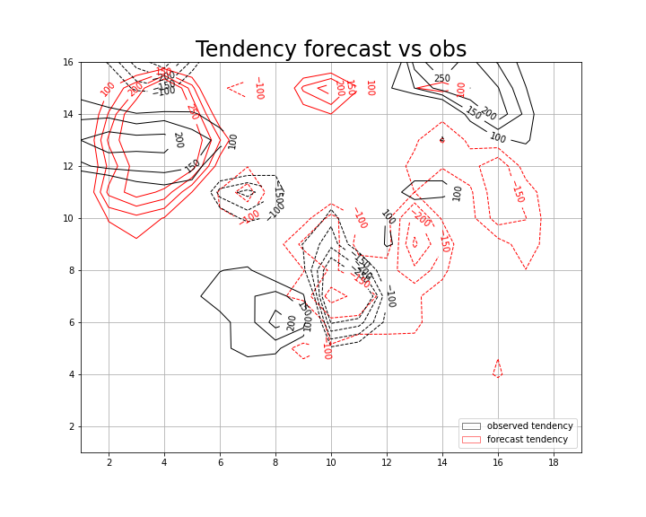

# Numerical Integration of the Barotropic Vorticity Equation

We integrated the system which describes the Barotropic Vorticity Z over the rectangular domain of coordinates, corresponding roughly to North America, every half an hour, for 24 hours.
The provided initial conditions consisted of the field of Z at 500 hPa derived from observations for the 5th of January 1949, representing t0.
The Leapfrog method and a linear extrapolation of the boundaries for the Laplacian were used to achieve the numerical integration, resulting in a time-dependent forecast.

The numerical integration proceeds as follow. 
The initial-conditions file, consisting of data for geopotential eight in a 19x16 grid, is read as the starting point of the forecast. From this intial values of Z we compute the Laplacin with the "make_Laplacian" function that reads the Z field and return a 17x15, thus exclunding boundaries. Boundaries are then computed with the "extrapolate" function that extrapolate linearly the boundaries according to:
\[X_{i,0}=2*X_{i,1}-X_{i,2} ,
X_{i,M}=2*X_{i,M-1}-X_{i,M-2} ;\]
and similarly for intial and final row. The four corners are then updated.
At this point we can derive J from Z and the absolute vorticity,\[h*L+f], with the "make_Jacobian" function. Then, the "Poisson_solver" function reads the Jacobian and gives the tendecy for Z. The first time step is integrated with according to the Euler method. The following time steps, instead z is updated with a leapfrog method keeping Z and J fixed at the boundaries. 

## Immagini da rifare con un titolo, magari farne anche una forecast vs Z24 
The following plot shows contour lines for the forecast at t= t0 + 24h, in red, compared to t0, in black. 

Comparing the forecast RMSE with a 0-cost forecast, Z0 in place of the time dependent forecast, we unequivocally understand that the forecast skills are worst, even if of the same order of error, of the 0-cost forecast. 
