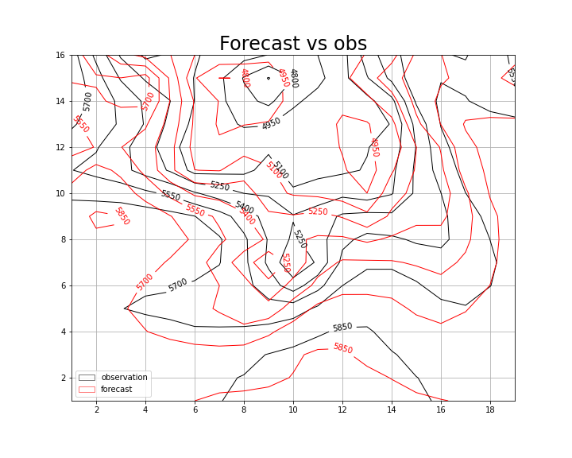

# Numerical Integration of the Barotropic Vorticity Equation

We integrated the system which describes the Barotropic Vorticity Z over the rectangular domain of coordinates, corresponding roughly to North America, every half an hour, for 24 hours.
The provided initial conditions consisted of the field of Z at 500 hPa derived from observations for the 5th of January 1949, representing t0.
The Leapfrog method and a linear extrapolation of the boundaries for the Laplacian were used to achieve the numerical integration, resulting in a time-dependent forecast.

The numerical integration proceeds as follow. 
The initial-conditions file, consisting of data for geopotential eight in a 19x16 grid, is read as the starting point of the forecast. From this intial values of Z we compute the Laplacin with the "make_Laplacian" function that reads the Z field and return a 17x15, thus exclunding boundaries. Boundaries are then computed with the "extrapolate" function that extrapolate linearly the boundaries according to:
\[X_{i,0}=2*X_{i,1}-X_{i,2} ,
X_{i,M}=2*X_{i,M-1}-X_{i,M-2} ;\]
and similarly for intial and final row. The four corners are then updated.
At this point we can derive J from Z and the absolute vorticity,\[h*L+f], with the "make_Jacobian" function. Then, the "Poisson_solver" function reads the Jacobian and gives the tendecy for Z. The first time step is integrated with according to the Euler method. The following time steps, instead z is updated with a leapfrog method keeping Z and J fixed at the boundaries. 

The following plot shows contour lines for the forecast at t= t0 + 24h compared to t0 (Fig.1) and to the observed state after 24 hours (Fig.2). Fig.3 compares the forecast tendency with the observed one. 

 
*Figure 1: comparison between forecast (red) and Z0 persistency (black)*

*Figure 2: comparison between forecast (red) and Z24 observation (black)*

*Figure 3: comparison between forecast tendency (red) and observed (black)*

Comparing the forecast RMSE with a 0-cost forecast, Z0 persistency, we unequivocally understand that the forecast skills are worst, even if of the same order of error, of the 0-cost forecast (forecast RMSE of the order of 74 vs persistence error of the order of 61).

## Discussion
Given that, as discussed during the lecture, the are multiple ways to improve the model and reduce the error, we discuss here 3 different proposals, even if in principle are not the dominant factor for the discrepancies with the observed state.

### Boundary Conditions
We noted that the system is sensitive to different Laplacian boundary condition. The first attempt,as discussed before, has been perfomed by interpolating lineary with to closest grid points in the same row/column. This approach, despite its semplicity, is clearly overestimating the dependency over these two closest grid points in the same row/column while negleting the interaction with closest points over different columns/rows. We therefore refined the boundary extrapolation taking into account first and second closest points. For example for 0-column:
\[X_{i,0}=1/3*X_{i,1}+1/3X_{i-1,0}+1/3X_{i+1,0} +1/6X_{i-1,1} +1/3X_{i+1,1}  ;\]

With this approach we were able to reduce the RMSE by 3 points. How can be observed in Fig.4 (compare with Fig.3) the improvements is confined mainly to the regions close to the boundary, as expected.
   
 
*Figure 4: comparison between forecast tendency (red) and observed (black) with the closest-points boundary scheme*
