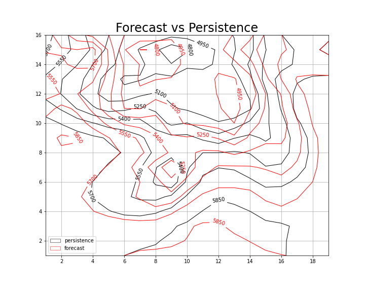

# Numerical Integration of the Barotropic Vorticity Equation

The 2-dimensional barotropic vorticity equation, first integrated by Charney and von Neumann, simplifies the Navier-Stokes equations by considering terms describing low-frequency, frictionless synoptic-scale processes. It assumes quasi-geostrophic conditions.
Thus, the system of equations allows variation of f and should depict Rossby waves, while filtering out fast gravity and sound waves, which were one of the identified causes of divergence in previous Richardson's numerical predictions. 

The geopotential height of Z = 500 hPa (in the following called Z500), in the mid-troposphere, is chosen as it is well approximated by the barotropic model. At this level, the absolute (barotropic) vorticity coincides with the potential vorticity, which is materially conserved in the real atmosphere. 

## Numerical integration

We integrate the system which describes the geopotential height Z over the rectangular domain of coordinates, corresponding roughly to North America, every half an hour, for 24 hours. The spatial increment is .
The provided initial conditions consist of the field of Z500 derived from observations for the 5th of January 1949, representing t0. The space and time increments in the finite difference equations satisfy the Courant-Fricdrichs-Lcwy condition for the computational stability of the equation governing the system.

The numerical integration proceeds as follows:

1. The initial-conditions file, consisting of data for geopotential eight in a 19x16 grid, is read as the starting point of the forecast.
2. From this intial values of Z we compute the Laplacian with the "make_Laplacian" function that reads the Z field and return a 17x15 grid, thus excluding boundaries.
3. Boundaries are then computed with the "extrapolate" function that extrapolate linearly the boundaries according to:
$$
[X_{i,0}=2*X_{i,1}-X_{i,2} ,
X_{i,M}=2*X_{i,M-1}-X_{i,M-2} ;]
$$ 
4. Similarly for initial and final row.
5. The four corners are then updated.
6. At this point we can derive J from Z and the absolute vorticity,\[h*L+f], with the "make_Jacobian" function.
7. Then, the "Poisson_solver" function reads the Jacobian and gives the tendecy for Z.

The first time step is integrated with according to the Euler method. The following time steps, instead z is updated with a leapfrog method keeping Z and J fixed at the boundaries. 

## Results

The following plot shows contour lines for the forecast at t= t0 + 24h compared to t0 (Fig.1) and to the observed state after 24 hours (Fig.2). Fig.3 compares the forecast tendency with the observed one. 

*Figure 1: comparison between forecast (red) and Z0 persistency (black)*

*Figure 2: comparison between forecast (red) and Z24 observation (black)*

*Figure 3: comparison between forecast tendency (red) and observed (black)*

The forecast reaches its best skill in predicting the tendency close to the cyclone center, while largest errors are found close to the boundary.
Comparing the forecast RMSE with a 0-cost forecast, Z0 persistency, we unequivocally understand that the forecast skills are worst, even if of the same order of error, of the 0-cost forecast (forecast RMSE of the order of 74 vs persistence error of the order of 61).

## Discussion
Given that, as discussed during the lecture, the are multiple ways to improve the model and reduce the error, we discuss here 3 different proposals, even if in principle are not the dominant factor for the discrepancies with the observed state.

### Boundary Conditions
We noted that the system is sensitive to different Laplacian boundary condition. The first attempt,as discussed before, has been perfomed by interpolating lineary with to closest grid points in the same row/column. This approach, despite its semplicity, is clearly overestimating the dependency over these two closest grid points in the same row/column while negleting the interaction with closest points over different columns/rows. We therefore refined the boundary extrapolation taking into account first and second closest points. For example for 0-column:
\[X_{i,0}=1/3*X_{i,1}+1/3X_{i-1,0}+1/3X_{i+1,0} +1/6X_{i-1,1} +1/3X_{i+1,1}  ;\]
With this approach we were able to reduce the RMSE by 3 points. How can be observed in Fig.4 (compare with Fig.3) the improvements is confined mainly to the regions close to the boundary, as expected.
   
 
*Figure 4: comparison between forecast tendency (red) and observed (black) with the closest-points boundary scheme*

### Baroclinic conditions and vertical resolution

State-of-the-art atmospheric models include multiple vertical layers. In this model, the level has been chosen to satisfy the barotropic conditions, thus assuming that baroclinic processes have little effect on Z. A model with more levels would weaken the assumption of barotropic conditions, since in layers different than Z500 the absolute vorticity is not conserved. Consequently, we argue that an increase in vertical resolution would robustly improve the forecast by considering baroclinic conditions and energy exchanges between layers. 
Moreover, in the real atmosphere baroclinic processes are of fundamental importance and they can affect the forecast of Z500 too.
The integration of potential vorticity instead of absolute vorticity could improve the forecast since it holds for all the atmospheric layers.

